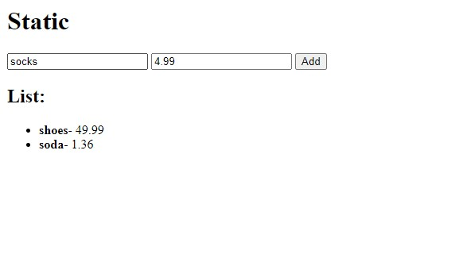

# My Own Static React Project

## Table of contents

- [Overview](#overview)
  - [The challenge](#the-challenge)
  - [Screenshot](#screenshot)
  - [Links](#links)
- [My process](#my-process)
  - [Built with](#built-with)
  - [What I learned](#what-i-learned)
  - [Continued development](#continued-development)
- [Instructions](#instructions)
- [Author](#author)
- [Acknowledgments](#acknowledgments)

## Overview

### The challenge

Users should be able to:

- Enter item name and price
- After pressing `Add`, item will be added to the list

### Screenshot



### Links

- Solution URL: [Add solution URL here](https://your-solution-url.com)
- Live Site URL: [Add live site URL here](https://your-live-site-url.com)

## My process

### Built with

- Semantic HTML5 markup
- JavaScript - Scripting language
- [Node.js](https://nodejs.org/) - JavaScript runtime environment
- [React](https://reactjs.org/) - JS library

### What I learned

Learned how to setup a static server

### Continued development

I am going to turn this into a React App next.

## Instructions

### Converting project into a React application

#### 1. Install Create React App and Create a New React Project

1. **Navigate to your project directory**:

```bash
cd my-node-project
```

2. **Create the React app inside your project directory**:

```bash
npx create-react-app client
```

#### 2. Move Your Static Files into the React App

1. **Move `index.html` content into `client/public/index.html`**:

   Open `client/public/index.html` and replace the content with your current `index.html` content:

```html
<!DOCTYPE html>
<html lang="en">
  <head>
    <meta charset="UTF-8" />
    <meta name="viewport" content="width=device-width, initial-scale=1.0" />
    <title>My React App</title>
  </head>
  <body>
    <noscript>You need to enable JavaScript to run this app.</noscript>
    <div id="root"></div>
  </body>
</html>
```

2. **Move `app.js` content into a new React component**:

   Create a new file `client/src/App.js` and use the following content:

```javascript
import React, { useState, useEffect } from "react";

function App() {
  // useState hooks for managing the items list, name, and price states
  const [items, setItems] = useState([]);
  const [name, setName] = useState("");
  const [price, setPrice] = useState("");

  // useEffect hook to fetch items from the server when the component mounts
  useEffect(() => {
    fetchItems();
  }, []);

  // Function to fetch items from the server
  const fetchItems = async () => {
    // Make a GET request to the /api/items endpoint
    const response = await fetch("/api/items");
    // Parse the JSON response
    const items = await response.json();
    // Update the items state with the fetched items
    setItems(items);
  };

  // Function to add a new item to the server and update the state
  const addItem = async (e) => {
    // Prevent the default form submission behavior
    e.preventDefault();
    // Make a POST request to the /api/items endpoint with the new item data
    const response = await fetch("/api/items", {
      method: "POST",
      headers: {
        "Content-Type": "application/json",
      },
      body: JSON.stringify({ name, price }),
    });

    // If the request is successful, parse the JSON response
    if (response.ok) {
      const newItem = await response.json();
      // Update the items state by adding the new item
      setItems([...items, newItem]);
      // Clear the input fields
      setName("");
      setPrice("");
    }
  };

  return (
    <div>
      <h1>Static</h1>
      {/* Form for adding new items */}
      <form id="itemForm" onSubmit={addItem}>
        <input
          type="text"
          name="name"
          placeholder="Item"
          value={name}
          onChange={(e) => setName(e.target.value)}
          required
        />
        <input
          type="text"
          name="price"
          placeholder="Price"
          value={price}
          onChange={(e) => setPrice(e.target.value)}
          required
        />
        <button>Add</button>
      </form>
      <h2>List:</h2>
      {/* List of items */}
      <ul id="list">
        {items.map((item, index) => (
          <li key={index}>
            <b>{item.name}</b> - {item.price}
          </li>
        ))}
      </ul>
    </div>
  );
}

export default App;
```

3. **Update `client/src/index.js` to render the `App` component**:

```javascript
import React from "react";
import ReactDOM from "react-dom";
import "./index.css";
import App from "./App";

ReactDOM.render(
  <React.StrictMode>
    <App />
  </React.StrictMode>,
  document.getElementById("root")
);
```

#### 3. Update the Node.js Server

1. **Modify `server.js` to serve the React build files**:

```javascript
const express = require("express");
const path = require("path");
const bodyParser = require("body-parser");

const app = express();
const port = process.env.PORT || 3001;

let items = [];

// Middleware to parse JSON bodies
app.use(bodyParser.json());

// Serve the static files from the React app
app.use(express.static(path.join(\_\_dirname, 'client/build')));

// API endpoint to get items
app.get("/api/items", (req, res) => {
res.json(items);
});

// API endpoint to add an item
app.post("/api/items", (req, res) => {
const newItem = req.body;
items.push(newItem);
res.status(201).json(newItem);
});

// All other requests return the React app, so it handles routing
app.get('\*', (req, res) => {
res.sendFile(path.join(\_\_dirname, 'client/build', 'index.html'));
});

// Start the server
app.listen(port, () => {
console.log(`Server is running on http://localhost:${port}`);
});
```

#### 4. Build and Run the Project

1. **Build the React app for production**:

```bash
cd client
npm run build
cd ..
```

2. **Start the Node.js server**:

```bash
node server.js
```

#### 5. Access the React App

Open your browser and navigate to `http://localhost:3001`. You should see your React app running and fetching data from the server.

### Summary of Project Structure

Your project structure should look like this:

```java
my-node-project/
├── client/
│ ├── build/
│ ├── public/
│ │ └── index.html
│ ├── src/
│ │ ├── App.js
│ │ ├── index.css
│ │ └── index.js
│ ├── package.json
│ └── node_modules/
├── node_modules/
├── package.json
├── package-lock.json
└── server.js
```

### Managing a single Git repository for both your Node.js backend and React frontend

#### 1. Remove the Git Repository in the client Folder

First, remove the `.git` directory inside the `client` folder. This will delete the Git repository in the `client` directory.

```bash
cd client
rm -rf .git
cd ..
```

#### 2. Initialize a Git Repository in the Parent Folder

Navigate to the parent directory (your project root) and initialize a new Git repository.

```bash
cd my-node-project
git init
```

#### 3. Create a .gitignore File

Create a `.gitignore` file in the root of your project to specify which files and directories should be ignored by Git. This file should include entries for `node_modules`, the build output directory, and other files that should not be tracked by Git.

```bash
touch .gitignore
```

Add the following content to the `.gitignore` file:

```bash
# Node.js

node_modules/
.env

# React

client/node_modules/
client/build/

# Logs

logs
_.log
npm-debug.log_
yarn-debug.log*
yarn-error.log*

# OS generated files

.DS_Store
Thumbs.db

# Optional: ignore the entire .vscode folder if you use Visual Studio Code

.vscode/
```

#### 4. Stage and Commit Your Changes

Stage and commit all your files to the new Git repository in the parent directory.

```bash
git add .
git commit -m "Initial commit"
```

#### 5. Push to a Remote Repository (Optional)

If you have a remote repository (e.g., on GitHub, GitLab, etc.), add the remote repository URL and push your code.

```bash
git remote add origin <remote_repository_url>
git push -u origin master
```

## Author

- Website - [Cameron Howze](https://camkol.github.io/)
- Frontend Mentor - [@camkol](https://www.frontendmentor.io/profile/camkol)
- GitHub- [@camkol](https://github.com/camkol)
- LinkedIn - [@cameron-howze](https://www.linkedin.com/in/cameron-howze-28a646109/)
- E-Mail - [cameronhowze4@outlook.com](mailto:cameronhowze4@outlook.com)

## Acknowledgments

My friend Daniel to push me to learn it.

```

```
